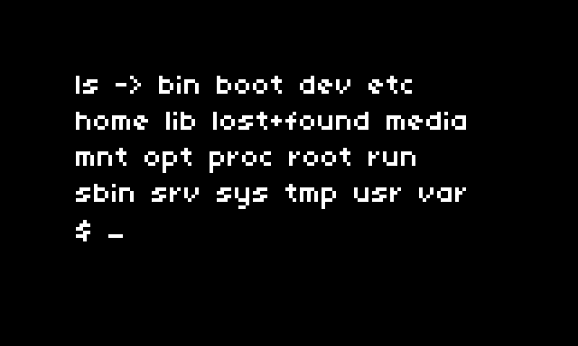

# tiny-term
 WIP - a super basic terminal emulator-ish script for norns
 

## tiny-term is a simple terminal emulator-ish script for norns 
- the script opens with a prompt `>` and blinking cursor `_`
- input from keyboard displays after the prompt `> cd home/we/dust_`
- pressing `enter` will  execute the command.
- the display will show the executed command and the resulting output
    - `pwd -> /home/we/dust/audio`
- the display can be scrolled using k2 or keyboard arrow keys
	
- there is currently no error handling, command history, or special key support
- typical terminal applications will not be able to run ie: text editors, file managers, etc. 

## features:
- can run most shell commands that don't require user interaction and don't rely on specific terminal features.
- commands you should be able to run:
	- File and directory operations: `ls`, `pwd`, `cd`, `cp`, `mv`, `rm`, `mkdir`, `rmdir`, etc.
	- Text processing: `cat`, `more`, `less`, `head`, `tail`, `grep`, `sed`, `awk`, etc.
	- System information: `date`, `uptime`, `who`, `uname`, etc.
	- Network operations: `ping`, `netstat`, `curl`, `wget`, etc.
	- Process management: `ps`, `kill`, `top`, etc. (note: `top` is a terminal-based program, but it can be used in batch mode, which doesn't require a terminal. For example, `top -b -n 1` runs `top` in batch mode and exits after one iteration.)
- commands that you won't be able to run include terminal-based programs that require user interaction or rely on specific terminal features. Examples: `vi`, `nano`, `less`, `more`, `top` (in interactive mode), `ssh`, `tmux`, etc.

## to-do:
- [ ] ctrl + l clear
- [ ] add command history (up and down keys) - need to rethink movement keys (vim keys?)
- [ ] handle "TERM environment variable not set." lock-up

## archive: 
- [x] scroll to top of output when command is run
- [x] scroll to cursor when typing next command (if output is too long to show cursor on first page)
- [x] work on output formatting
- [x] working prototype

## log:
- 2024-02-23
    - first draft
    - able to move around through directories, and execute basic commands
    - added prompt display and cursor
- 2024-02-24
    - scroll to prompt when entering a new command (helps when in a long block of output text)
    - scroll to top of output after command is run (no longer have to scroll to beginning)
    - tried to find a way around getting terminal-based apps (ie: vi, top, less, etc) to work, but options are sliiiim
        - lua has a luaposix library, but not sure if its worth the hassle.
    - screen / format tweaks
